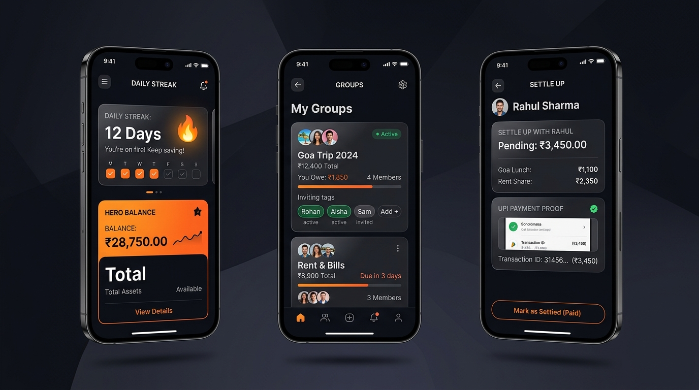

# ⚡ DhanWiser

<div align="center">


### **Smart Expense Splitting. Effortless Balance. Built for the Modern Financier.**

*The high-trust social expense engine designed for friends, roommates, and travel circles — with zero ads, verified payment proofs, and daily financial habit tracking.*

---

[](https://flutter.dev)
[](https://dart.dev)
[](https://nodejs.org)
[](https://www.postgresql.org)
[](https://dhanwiser.vercel.app)
[](LICENSE)

[**Live Web App**](https://dhanwiser.vercel.app) • [**API Documentation**](backend/README.md) • [**Design System**](DESIGN.md)

</div>

---

## 🌟 Why DhanWiser?

Traditional group expense apps like Splitwise have become bloated with **intrusive 10-second paywalls, subscription fees for basic analytics, and outdated user interfaces**. Meanwhile, tracking bills in messy WhatsApp groups leads to forgotten IOUs, lost receipts, and awkward money conversations.

**DhanWiser was engineered from the ground up to solve this.** It merges precision financial ledger algorithms with a luxury **Obsidian & Tangerine fintech aesthetic**, transparent social discovery, and a daily habit loop that keeps friend circles in sync.

---

## 🥊 How We Compare

| Feature | ⚡ **DhanWiser** | 🐢 Splitwise | 📋 Tricount / Settle Up | 💬 WhatsApp / Notes |
| :--- | :---: | :---: | :---: | :---: |
| **Pricing & Ads** | **100% Free • 0 Ads • 0 Paywalls** | Aggressive Ads & Subscription paywalls | Banner Ads & In-App Purchases | Free |
| **Payment Verification** | **Transaction ID + Photo Proof Audit** | ❌ Manual honor system only | ❌ Manual checkmark | ❌ Unorganized chat photos |
| **Social Discovery** | **Instant `@username` handles & 1-tap links** | Clunky phone number / email sync | Raw URL sharing only | Contacts only |
| **Daily Engagement** | **🔥 Daily Ledger Sync & Financial Streaks** | ❌ None (opened once a month) | ❌ None | ❌ None |
| **Design Aesthetic** | **Obsidian Dark & Bold Orange Fintech** | Dated Material 2.0 | Android 4.0 style | Basic text |
| **Smart Reminders** | **Autonomous Interval Daemon (1–30 days)** | Paid Pro feature only | ❌ None | Awkward manual DMs |
| **Debt Simplification** | **Built-in Minimum Transaction Graph** | Paid "Simplify Debts" tier | Basic | ❌ Manual math |

---

## 📱 Feature Showcase

<div align="center">



*Left: Daily Habit Streak & Hero Balance • Center: Collaborative Spaces & Quick Invites • Right: Verified Settle-Up with UPI Proof*

</div>

---

## ⚡ Core Highlights

### 1. 🔥 Daily Ledger Streak & Financial Habit Loop
Most expense apps are "ghost towns" until a vacation bill arrives. DhanWiser introduces the **Daily Ledger Habit**:
- **Check-in Streaks**: Track consecutive days your finances remain squared (`🔥 X Days In Sync`).
- **Dynamic Ledger Status**: Real-time feedback pills:
  - `✨ Clean Ledger • All balances perfectly square`
  - `⚡ Dues Pending • Review & settle with 1 tap`
  - `💰 Outstanding Receivables • Friends owe you`
- **Daily Fintech Insights**: Rotating daily rules on UPI zero fees, receipt verification speedups, and split equity.

### 2. 👥 Frictionless Social Discovery Hub
- **Personal `@username` Handle**: Privacy-first friend discovery without exposing personal phone numbers.
- **1-Tap Share Links**: Share your profile or group invites directly to WhatsApp, Telegram, or Messages.
- **Join via Code / Link**: Paste an invite code or link (e.g. `#104` or `https://dhanwiser.vercel.app/join/104`); regex instantly parses the ID and routes to the group.
- **Real-Time Invite States**: Live status tracking (`Invite` ➔ `Loading...` ➔ `Invited ✓`).

### 3. 🤝 Collaborative Groups & Trips
- **Open Member Invites**: Any member can invite travel companions and roommates — no administrative bottlenecks.
- **Instant Group Creation**: Interactive post-creation celebration sheet with immediate friend invite options.
- **Smart Search Fallback**: Searching for a friend in Groups automatically offers a 1-tap bridge to the Friends Hub.

### 4. 🧾 Verified Settle-Up Engine
- **UPI Reference Tracking**: Enter transaction IDs or UPI reference numbers for transparent reconciliation.
- **Base64 Screenshot Proof**: Attach payment confirmation screenshots directly to the settlement request.
- **Two-Way Approval Flow**: Receivers inspect the proof before marking the ledger as cleared.

### 5. 📊 Interactive Visual Analytics
- **Category Spending Charts**: Real-time pie and bar breakdowns (Food, Travel, Bills, Entertainment).
- **Spender Leaderboard**: Discover who is carrying group expenses and who needs to square up.
- **Minimum Transaction Optimizer**: Simplifies multi-person debt cycles into the fewest possible payments.

---

## 🏗️ Repository Architecture

DhanWiser is organized as a clean, production-ready monorepo separating client and server:

```
dhanwiser_fixed/
├── lib/                         # Pure Flutter Application Code
│   ├── main.dart                # App routing & theme initialization
│   ├── models/                  # Strong data models (Expense, Server, User, Balance)
│   ├── providers/               # MultiProvider reactive state layer
│   ├── screens/                 # 19 production-grade screen flows
│   ├── services/                # API Client, StreakService, Cache, Deep Links
│   ├── theme/                   # Iconly Pro icons, Design Tokens & Bold Orange Palette
│   ├── utils/                   # Formatters, JSON parsers, Validators
│   └── widgets/                 # Reusable UI components & Hero cards
├── assets/                      # Fonts (Iconly Pro) & screenshots
│   ├── fonts/                   # IconlyBold, IconlyLight, IconlyBroken TTF fonts
│   └── screenshots/             # High-res product mockups & launch assets
├── test/                        # Automated unit & widget test suites
├── backend/                     # Dedicated Node.js & Express REST API
│   ├── server.js                # Server entry point with auto table migrations
│   ├── package.json             # Backend dependencies (Express, PG, JWT)
│   ├── .env.example             # Clean environment variables template
│   └── src/                     # Controllers, Routes, Middleware, Services, DB Pool
├── android/                     # Android native platform files
├── ios/                         # iOS native platform files
├── web/                         # Web platform files (PWA manifest & headers)
├── DESIGN.md                    # Canonical design system specification
├── vercel.json                  # Flutter Web automated build configuration
└── pubspec.yaml                 # Flutter dependencies & metadata
```

---

## 🚀 Quickstart Guide

### Prerequisites
- [Flutter SDK](https://flutter.dev/docs/get-started/install) (`>= 3.3.0`)
- [Node.js](https://nodejs.org/) (`>= 18.0.0`)
- [PostgreSQL](https://www.postgresql.org/) (or Supabase / Neon DB instance)

---

### 1. Frontend Setup (Flutter)

```bash
# Clone the repository
git clone https://github.com/Tanish-SuperRonin/DhanWiser-APP.git
cd DhanWiser-APP

# Install Flutter dependencies
flutter pub get

# Run unit & widget tests
flutter test

# Start the application (Chrome, Android Emulator, or iOS Simulator)
flutter run -d chrome
```

---

### 2. Backend Setup (Node.js & Express)

```bash
# Navigate to the backend directory
cd backend

# Install dependencies
npm install

# Configure environment variables
cp .env.example .env
# Edit .env with your DATABASE_URL and JWT_SECRET

# Start development server
npm run dev
```

---

## 🎨 Design System: "Obsidian & Tangerine"

DhanWiser implements a bespoke design language engineered for readability, depth, and tactile delight:

| Token | Light Theme | Dark Theme | Purpose |
| :--- | :---: | :---: | :--- |
| **Background** | `#F5F4F0` | `#11120F` | Deep obsidian surface base |
| **Surface** | `#FFFFFF` | `#191A17` | High-contrast card elevations |
| **Primary Accent** | `#EA580C` | `#FF7D3B` | Energetic, bold tangerine |
| **Emerald** | `#16A34A` | `#22C55E` | Positive cash flow & clean ledger status |
| **Coral** | `#E11D48` | `#F43F5E` | Debts owed & settlement alerts |
| **Typography** | Plus Jakarta Sans | Plus Jakarta Sans | Modern geometric financial legibility |
| **Icon Pack** | Iconly Pro | Iconly Pro | Custom flat vector icons (`IconlyBold`, `IconlyLight`) |

*For complete design documentation, review [DESIGN.md](DESIGN.md).*

---

## 🧪 Testing & Verification

DhanWiser maintains rigorous quality benchmarks with zero compile warnings:

```bash
# Run static analysis
flutter analyze

# Run all test suites
flutter test
```

```
✓ palette switches every core surface between dark and light mode
✓ StreakService records check-in and tracks streak and clean ledger status
✓ StreakService handles receivables status correctly
✓ App smoke test
========================================================================
All tests passed! (4/4)
```

---

## 👥 Authors & Acknowledgments

- **Smit Nayi** ([@smitnayi](https://github.com/smitnayi)) — UX Architecture, Social Discovery, Design Tokens & Habit Loops
- **Tanish Shah** ([@Tanish-SuperRonin](https://github.com/Tanish-SuperRonin)) — Backend Architecture & Core Ledger Engine

---

<div align="center">

**Built with ❤️ for high-trust circles everywhere.**

[**Back to Top ↑**](#-dhanwiser)

</div>
